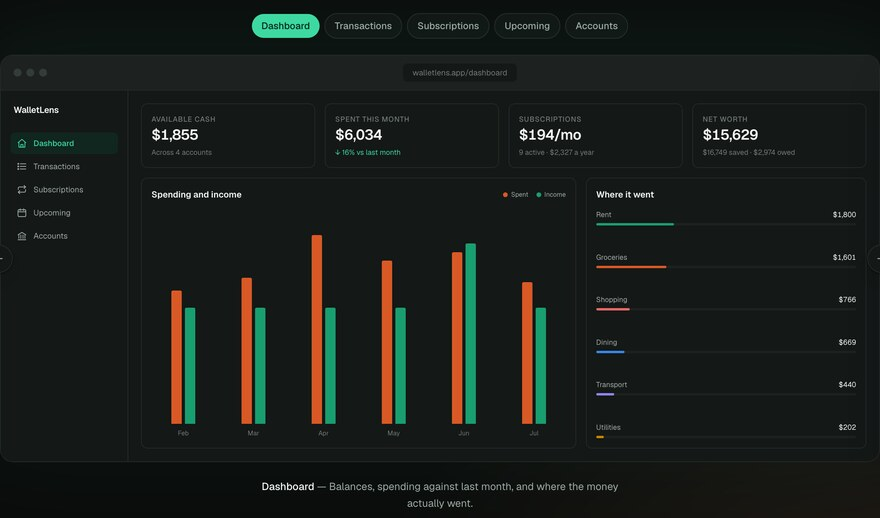
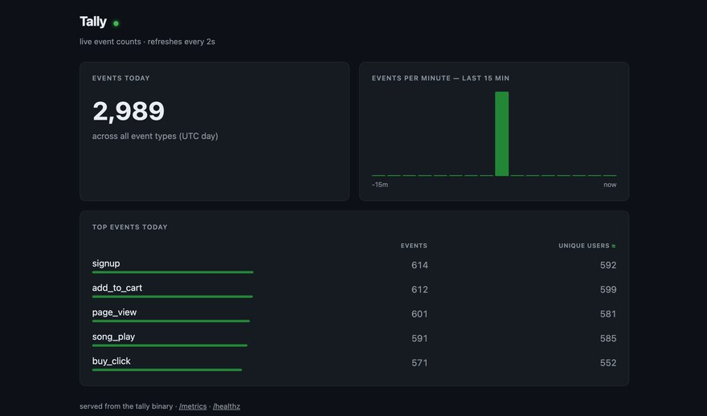
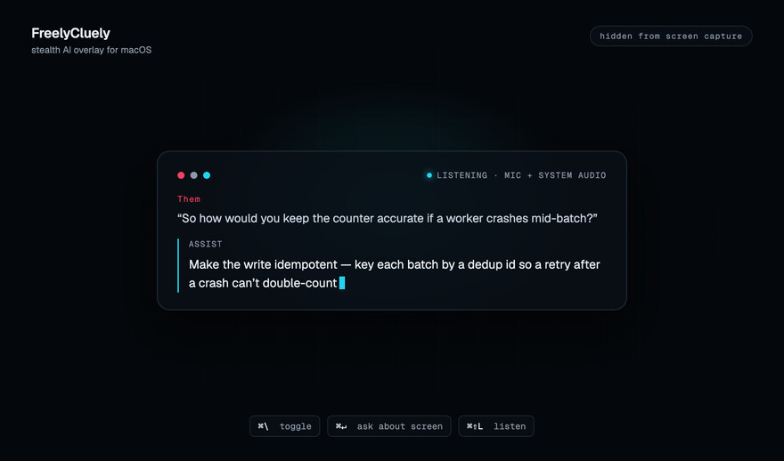
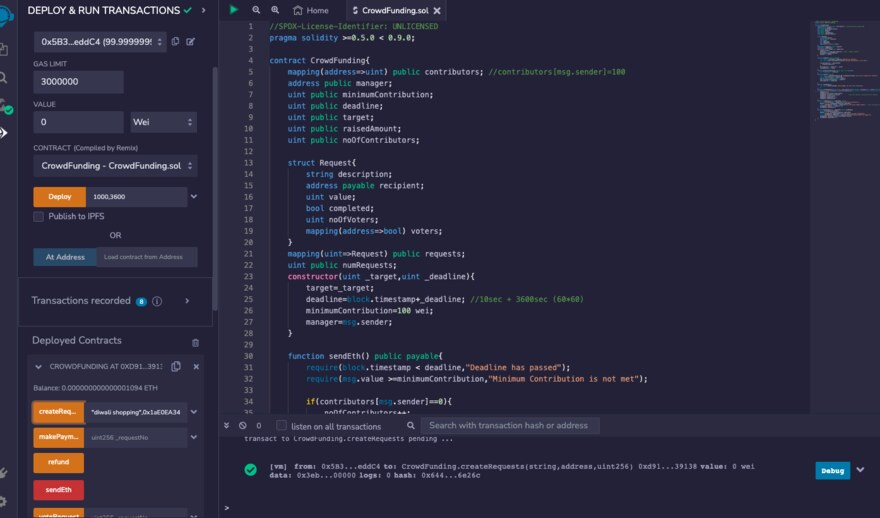

# Shreyas Chaudhary — Portfolio

A modern, engineering-themed portfolio built with Next.js, TypeScript, Tailwind CSS, and Three.js. The hero features an interactive 3D distributed-system node network rendered with React Three Fiber, and every section is driven by typed data models — updating content never means touching components.

## Featured projects

Card art is a real capture of each project running — no mockups.

<table>
  <tr>
    <td width="50%">
      
      <br><strong>WalletLens</strong> — subscription detection and a 30-day cash forecast over Plaid, built as a free alternative to Rocket Money.
    </td>
    <td width="50%">
      
      <br><strong>Tally</strong> — a high-throughput event counting service in Go, with unique-user counts from a from-scratch HyperLogLog.
    </td>
  </tr>
  <tr>
    <td width="50%">
      
      <br><strong>FreelyCluely</strong> — a stealth macOS AI overlay that macOS excludes from screen sharing, transcribing locally with Whisper.
    </td>
    <td width="50%">
      
      <br><strong>PaySmart</strong> — an Ethereum crowdfunding escrow where no payment leaves the contract without contributor majority approval.
    </td>
  </tr>
</table>

## Stack

- **Next.js** (App Router) + **React 19** + **TypeScript**
- **Tailwind CSS v4** — design tokens via CSS variables, dark theme default with light-theme toggle
- **Three.js + React Three Fiber** — hero scene, dynamically imported, degrades gracefully on mobile and respects `prefers-reduced-motion`
- **Framer Motion** — scroll reveals, transitions
- **Lucide** icons

## Getting started

```bash
npm install
npm run dev      # serves on port 3000
npm run build    # production build
npm run lint
```

## Project structure

```
app/                 # App Router: layout (SEO, JSON-LD), page, 404, error, sitemap, robots
components/
  sections/          # Hero, About, Experience, Projects, Skills, Architecture,
                     # Publications, GitHubActivity, Contact
  three/             # hero-scene.tsx — the R3F node network
  ui/                # Navbar, Footer, CommandPalette, Terminal, Toasts, etc.
data/                # ALL site content lives here (typed)
lib/                 # cn() helper, nav config
public/              # images, project media, resume.pdf
```

## Editing content

All content is data, separated from presentation:

| To change…                | Edit                    |
| ------------------------- | ----------------------- |
| Name, headline, socials   | `data/profile.ts`       |
| Jobs & education          | `data/experience.ts`    |
| Projects                  | `data/projects.ts`      |
| Skills                    | `data/skills.ts`        |
| Publications & certs      | `data/publications.ts`  |
| Architecture diagram      | `data/architecture.ts`  |
| GitHub static fallback    | `data/github.ts`        |

**Adding a project:** append an object to `data/projects.ts` (title, problem, solution, categories, stack, features, image under `public/projects/`, GitHub/demo links). Mark `featured: true` and add an `architecture` array to render it as a wide case-study card with an architecture strip.

**Adding an experience:** append to `data/experience.ts`. Use "Accomplished X, measured by Y, by implementing Z" bullets. Optional `details` array renders an expandable section; `current: true` adds the pulsing timeline marker.

**Resume:** replace `public/resume.pdf` with your latest resume.

## Environment variables

Copy `.env.example` to `.env.local`:

- `NEXT_PUBLIC_FORMSPREE_ENDPOINT` *(optional)* — a Formspree form endpoint for the contact form. When unset, the form falls back to opening the visitor's email client with a prefilled draft.

The GitHub section calls the public GitHub API at build/revalidate time (hourly) and silently falls back to `data/github.ts` if unavailable — no token required.

## Deployment (Netlify)

`netlify.toml` holds the build settings, so a new site needs no manual configuration:

- `npm run build`, publishing `.next`
- `NODE_VERSION = "22"` — Next.js 16 requires Node 20+
- `@netlify/plugin-nextjs`, which Netlify auto-installs on detecting that entry — this runs the app natively, giving SSR, the live GitHub API feed, and `next/image` optimization

1. Push to GitHub.
2. Create a new Netlify site from the repo — `netlify.toml` supplies the build command and publish directory.
3. Add `NEXT_PUBLIC_FORMSPREE_ENDPOINT` under Site configuration → Environment variables (optional).
4. Set your production domain, then update `siteUrl` in `data/profile.ts` so SEO metadata, sitemap, and JSON-LD point at it.

## Features

- Interactive 3D hero (cursor parallax, animated data packets, particle field)
- Command palette (`⌘K` / `Ctrl+K`) with navigation, project search, and actions
- Interactive terminal (footer, or `⌘K → Open Terminal`) — try `help`, or `sudo hire-me`
- Interactive system-architecture diagram with hover inspection
- GitHub activity with live API + static fallback
- Contact form with validation, honeypot spam protection, loading/success states
- Full SEO: metadata, Open Graph, sitemap, robots, JSON-LD Person schema
- Accessible: semantic HTML, keyboard navigation, focus states, reduced-motion support, skip link
- Custom 404 and error boundary

## Links

- [LinkedIn](https://www.linkedin.com/in/shreyaschaudharysc/)
- [GitHub](https://github.com/shreyas463)
